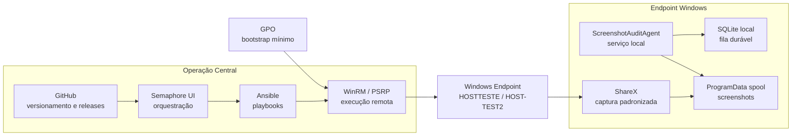

# Fluxo Operacional

## Leitura sugerida

- `GitHub` concentra código, versionamento e releases.
- `Semaphore + Ansible + WinRM` formam o plano de controle.
- `GPO` fica só como bootstrap mínimo.
- `ShareX` captura.
- `ScreenshotAuditAgent` executa o fluxo contínuo no endpoint.
- `SQLite local` garante retry e resiliência.
