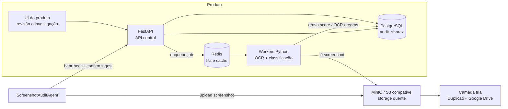

# Fluxo do Produto

## Leitura sugerida

- O `agent` envia a imagem para o `MinIO`.
- O `agent` envia telemetria e confirmação para a `FastAPI`.
- A `API` grava o estado oficial no `PostgreSQL`.
- A `API` publica jobs no `Redis`.
- Os `workers` fazem OCR, classificação e métricas.
- A UI do produto lê o resultado consolidado do backend.
