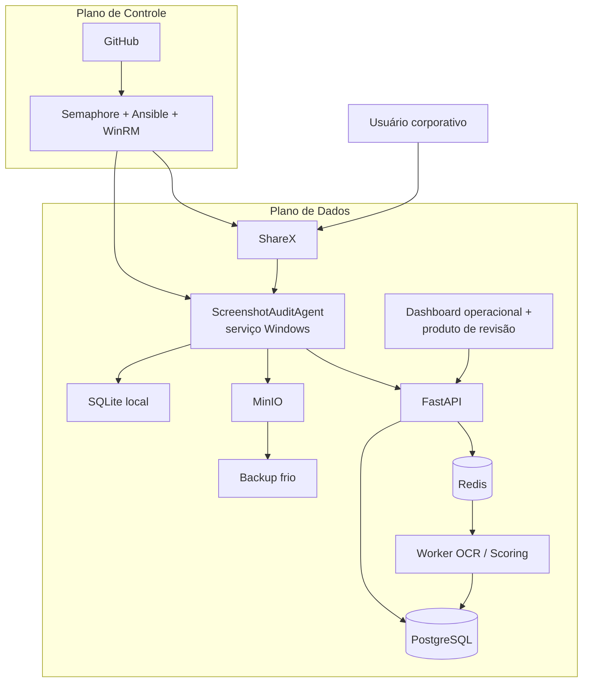

# Visão Geral

## Leitura sugerida

- O plano de controle cuida de rollout, versionamento e suporte.
- O plano de dados cuida de captura, ingestão, análise e revisão.
- Essa separação é a chave para explicar por que `Semaphore` não substitui a `API` do produto.
